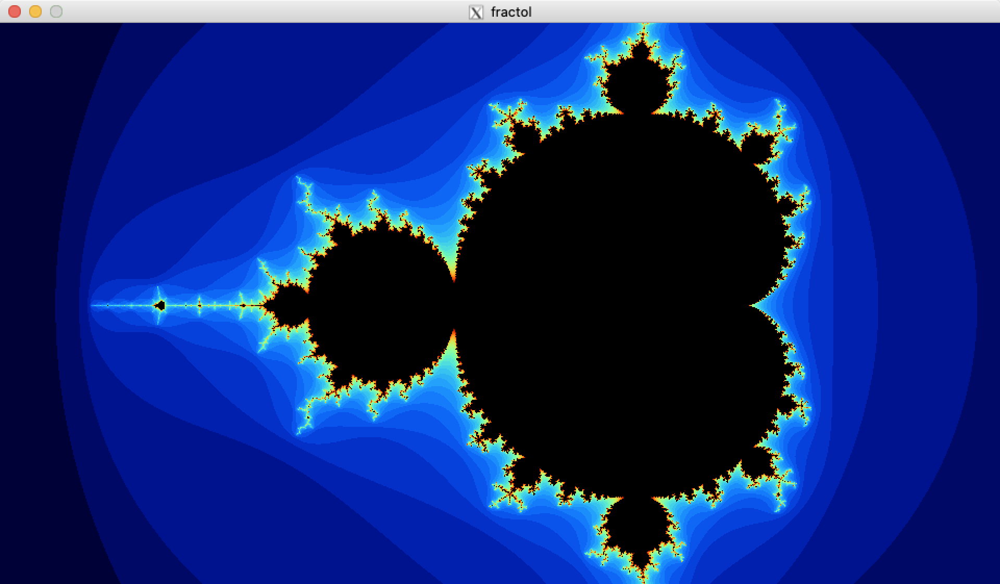
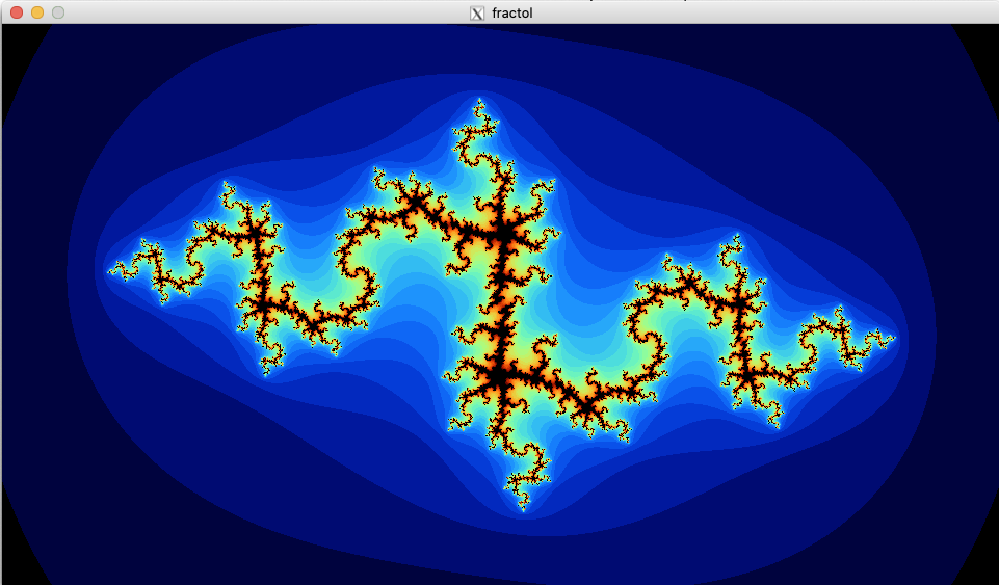
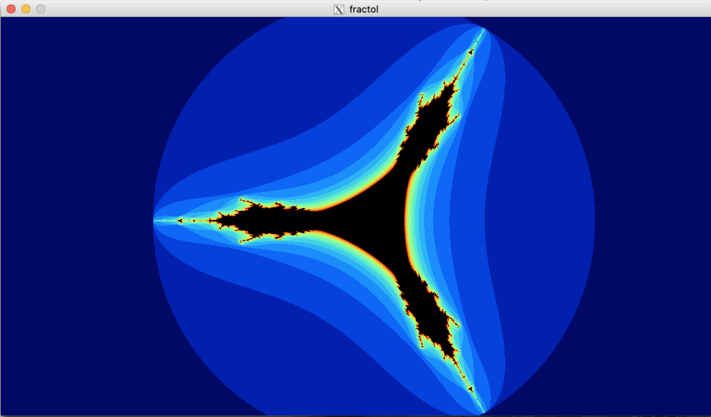

# Fractol

This project is about creating a small fractal exploration software in C.



## Installation

Use the makefile to compile the project.

```bash
make
```
Yes, it's that simple.

## Usage

```bash
./fractol [fractal]
```
You can choose between 3 fractals: mandelbrot, julia and tricorn.

## Controls

```bash
a/s/d              switch fractal
1/2/3/4/5/6        switch color
space              start/stop color animation (mode 6 only)
arrow keys         move
r                  reset
u                  (un)lock julia
scroll             zoom
LMB                new julia constant
ESC                exit program
```

## More Screenshots



